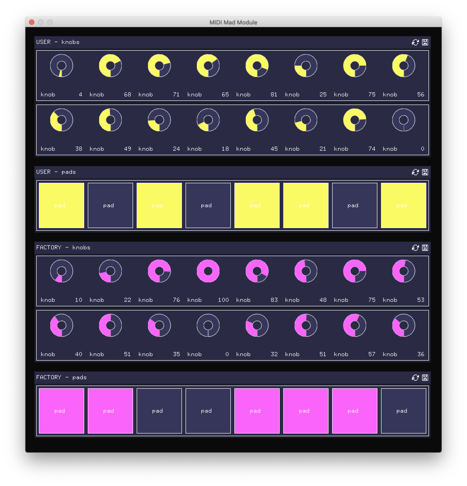

# 🌀 Barbabietola

**Barbabietola** is a sandbox environment to test and develop a MIDI controller module and visualization.

## Features

1. It provides _multiple windows_ by default `ofApp::draw()` target window is `OF_FULLSCREEN` in a secondary monitor.
2. Easy config for **novation - LaunchControl**, with custom labels and color

## UI

### Midi Module control

## ToDo

- [ ] Implement audio visualizer.
- [ ] Implement OSC for iOS controller.
- [ ] Provide basic shader implementation.
